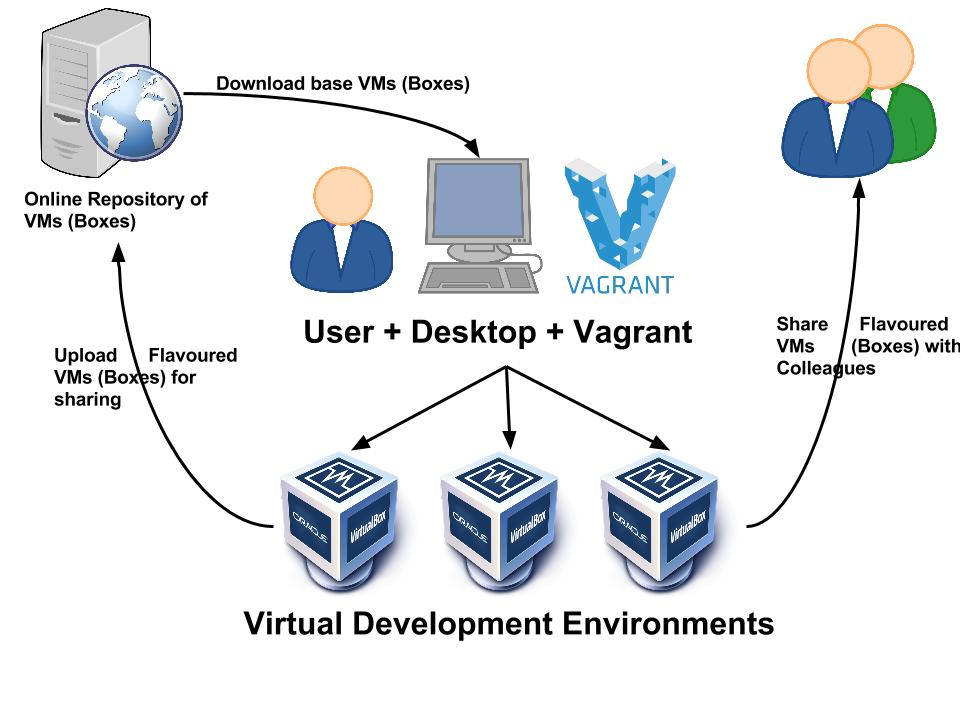

# 概述

本书主要介绍了使用Vagrant搭建开发环境的相关内容

# Github

https://github.com/ifnoelse/learning-vagrant

# 阅读地址

https://ifnoelse.gitbooks.io/learning-vagrant/content/

# Vagrant Workflow

# 目录

* [介绍](README.md)
* [Ruby基本语法](docs/ruby/README.md)
  * [基本语句](docs/ruby/basic.md)
  * [数据类型](docs/ruby/data_type.md)
  * [使用集合](docs/ruby/using_coll.md)
  * [定义方法](docs/ruby/def_method.md)
  * [流程控制](docs/ruby/flow_control.md)
  * [循环结构](docs/ruby/loop.md)
* [Vagrant](docs/vagrant/README.md)
  * [安装 Vagrant 与 Virtual Box](docs/vagrant/installing.md)
  * [快速体验](docs/vagrant/quickstart.md)
  * [常用命令](docs/vagrant/common_commands.md)
  * [单虚拟机环境](docs/vagrant/single_machine_environments.md)
  * [多虚拟机环境](docs/vagrant/multiple_machine_environments.md)
  * [系统安装之后的任务](docs/vagrant/post_installing_task.md)
  * [虚拟机网络](docs/vagrant/network.md)
  * [自作自己的 Box](docs/vagrant/making_box.md)
  * [使用 Vagrant Cloud](docs/vagrant/vagrant_cloud.md)
  * [Vagrnat 体验项目](docs/vagrant/vagrant_express.md)
* [参考文献](REFERENCE.md)