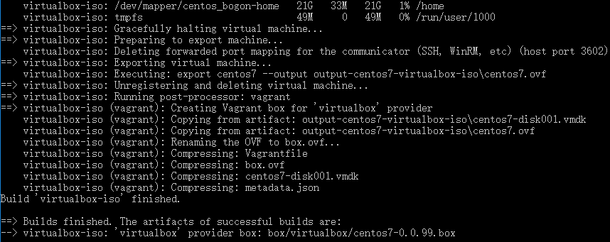

# 制作自己的 Box

## 制作 Box 所需要的工具

- packer：https://www.packer.io/
- packer配置文件：https://github.com/boxcutter
- 操作系统ISO文件：http://isoredirect.centos.org/centos/7/isos/x86_64/CentOS-7-x86_64-DVD-1708.iso

## 开始打包

**下载 packer 可执行文件**

将下载下来的 packer 可执行文件放到 Vagrant\bin 目录下

**下载centos box配置文件模板**

``` bash
git clone https://github.com/boxcutter/centos.git
```

**修改配置文件**

```bash
{
  "_comment": "Build with `packer build -var-file=centos7.json centos.json`",
  "vm_name": "centos7",
  "cpus": "1",
  "disk_size": "65536",
  "http_directory": "kickstart/centos7",
  "iso_checksum": "ec7500d4b006702af6af023b1f8f1b890b6c7ee54400bb98cef968b883cd6546",
  "iso_checksum_type": "sha256",
  "iso_name": "CentOS-7-x86_64-DVD-1708.iso",
  "iso_path": ".",
  "memory": "512",
  "parallels_guest_os_type": "centos7"
}

```

- `iso_path`：操作系统ISO文件路径
- `iso_name`：操作系统ISO文件名称
- `iso_checksum`：ISO数字签名值
- `iso_checksum_type`：ISO数字签名算法
- `cpus`：默认CPU核数
- `memory`：默认内存大小
- `disk_size`：默认磁盘大小（单位MB）

*执行打包命令*

``` bash
cd centos
packer build -only=virtualbox-iso -var-file=centos7.json centos.json
```


## 导入 box

通过以下命令将刚才打包好的 box 导入到 vagrant 中

``` bash
vagrant box add centos-7.3 box/virtualbox/centos7-0.0.99.box
```

导入成功之后执行以下命令，可以查看到刚才导入的 box 文件

``` bash
vagrant box list
```