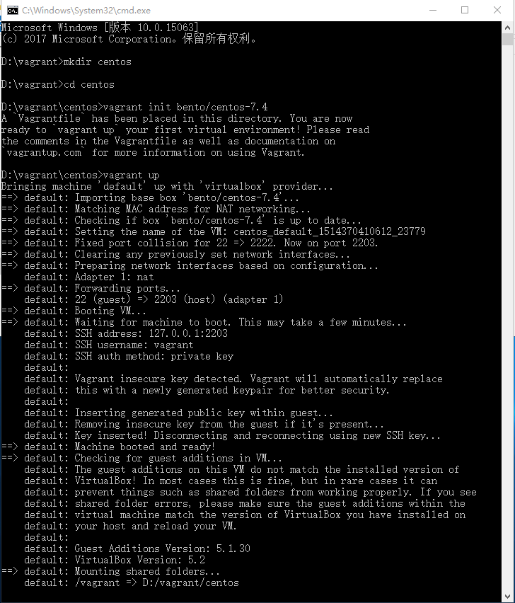

# 快速体验
## 使用默认配置启动虚拟机
``` bash
mkdir centos
cd centos
vagrant init bento/centos-7.4
vagrant up
```
> 如果本地没有bento/centos-7.4这个box，vagrant会自动从远程仓库下载 <br />
> 如果远程下载 box 太慢，请猛戳这里[自作自己的 Box](docs/vagrant/making_box.md)

执行效果如下：

## 登陆虚拟机
### 关于内置用户
- 默认通过vagrnat创建的虚拟机都内置了用户名：vagrant，密码：vagrant的用户
- 一般情况下root账户的密码也是vagrant
### 通过vagrant账户登陆
执行以下命令即可登陆通过vagrant账户登陆
``` bash
vagrant ssh
```
> 以上命令是通过秘钥登陆的所以不用输入用户名密码
### 通过ssh工具登陆
- 查看启动信息找到ssh地址信息，例如：“default: SSH address: 127.0.0.1:2203”
- 将“127.0.0.1:2203”输入到ssh工具地址栏
- 输入用户名密码vagrant/vagrant