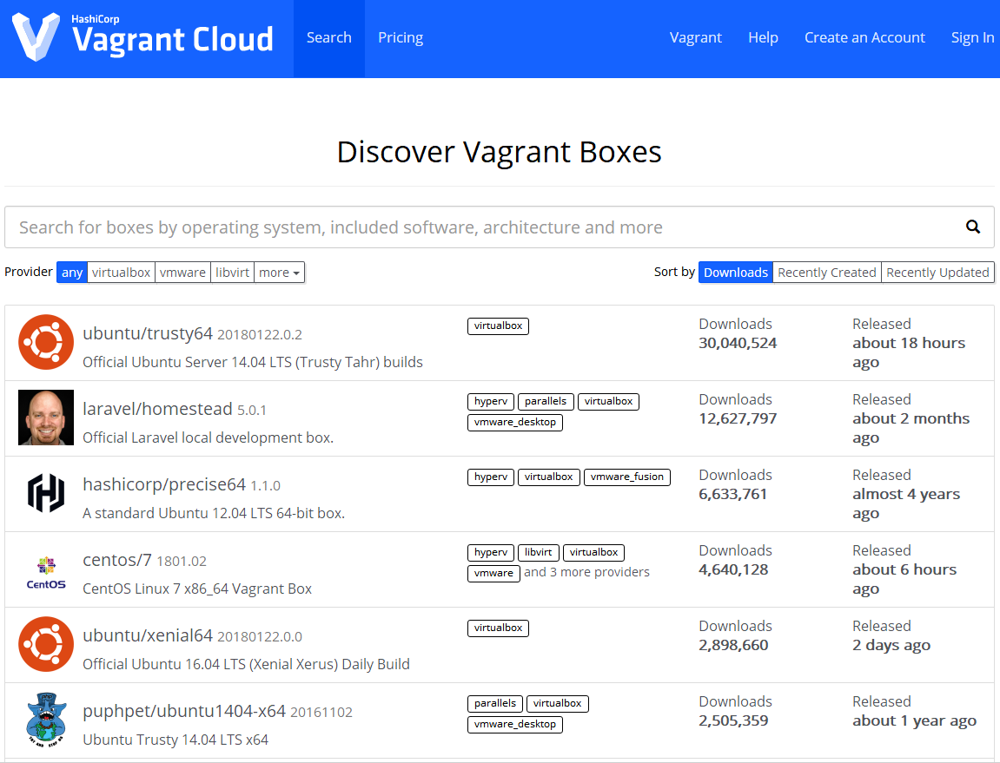
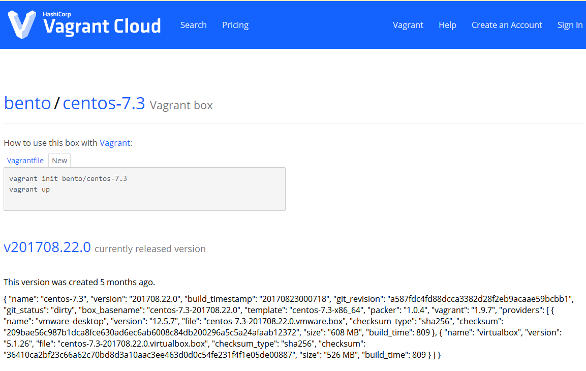

# Vagant Cloud
## 访问Vagrant Cloud
vagrant cloud 与 docker hub 或者 maven 仓库一样，都是用来存储公用组件或程序的地方，允许用户创建自己的 box 并上传至 Vagrant Cloud，当然所有这一切都是免费的

访问地址：https://app.vagrantup.com/boxes/search

## 查找自己想要的 box

> 推荐仓库：https://app.vagrantup.com/bento