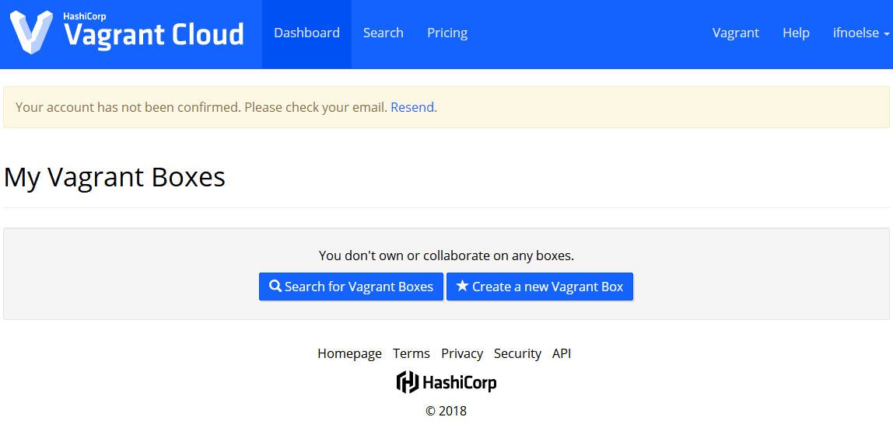
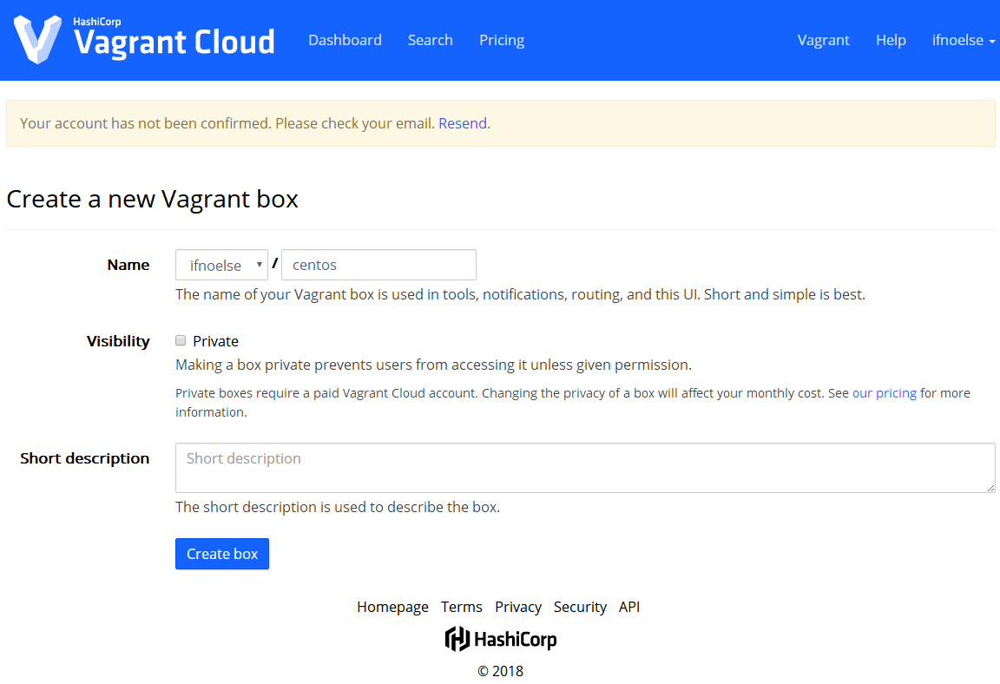
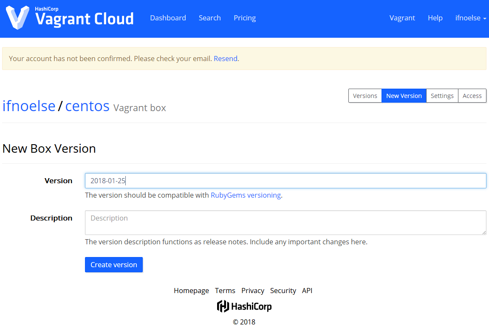
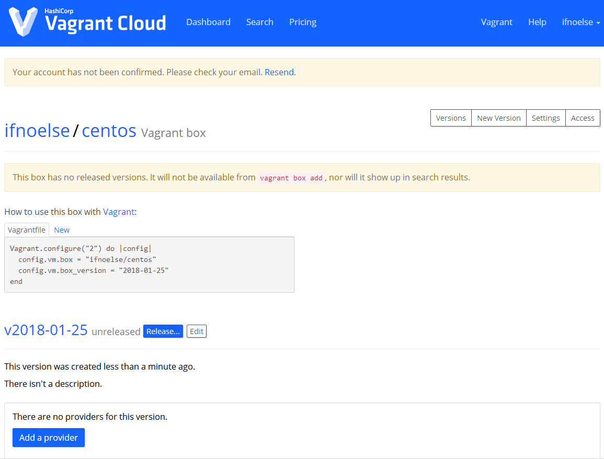
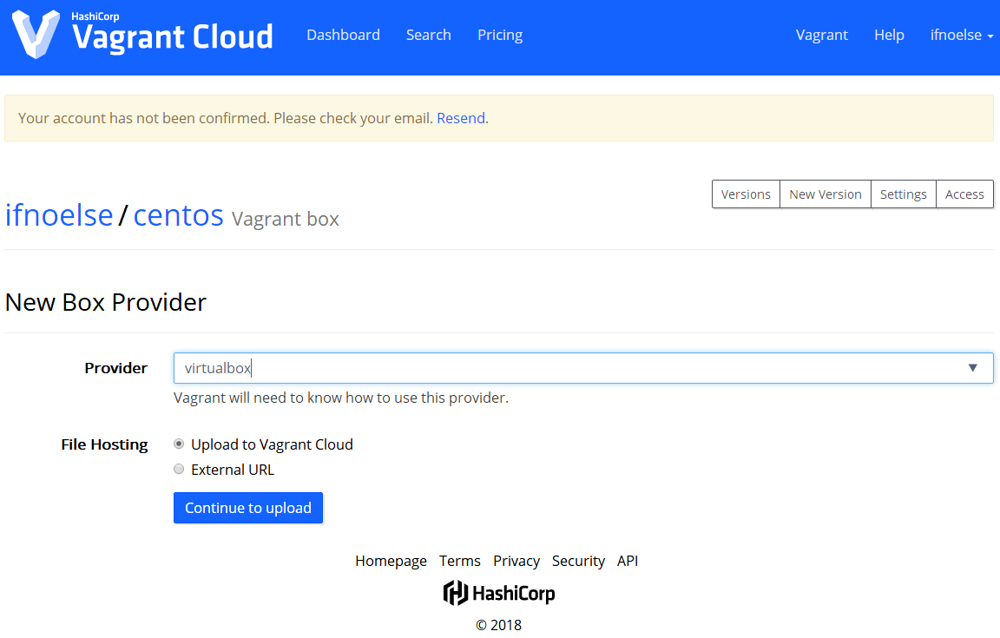

# Vagant Cloud

## 访问Vagrant Cloud

vagrant cloud 与 docker hub 或者 maven 仓库一样，都是用来存储公用组件或程序的地方，允许用户创建自己的 box 并上传至 Vagrant Cloud，当然所有这一切都是免费的

访问地址：https://app.vagrantup.com/boxes/search

## 查找自己想要的 Box

> 推荐仓库：https://app.vagrantup.com/bento

## 上传自己的 Box

**注册并登录 Vagrant Cloud**

注册地址：https://app.vagrantup.com/account/new

**发布 Box**

1、创建一个新的 Vagrant Box

2、填写 Box 名称及描述信息

3、填写 Box 版本信息，一般以时间为版本

4、点击 Add a provider 添加一个 provider 的 Box

1、选择 provider 类型，并上传 Box 文件

